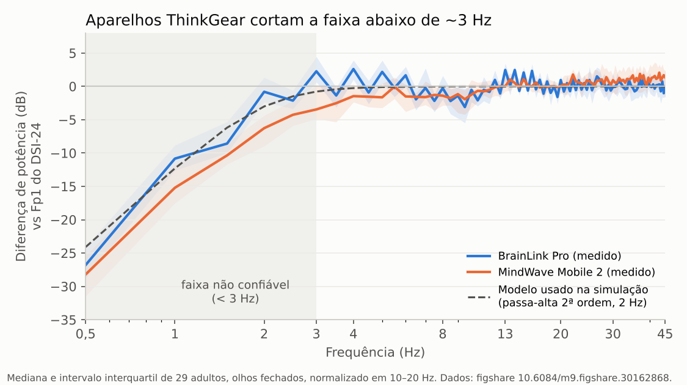
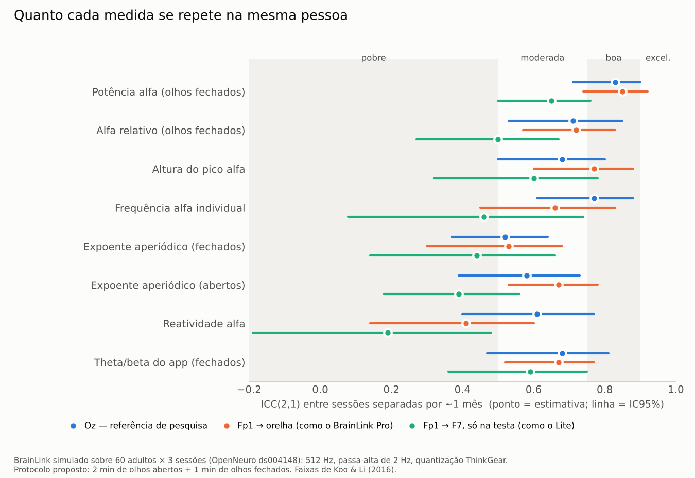

# Embasamento científico e projeto conjunto — App BrainLink

**Para quem é:** equipe do App BrainLink (Computação), professora e alunos de
Psicologia, orientador do PROBIC.
**Data:** 3 de outubro de 2026.

> [!warning] Regra que continua valendo
> Nada aqui permite que o app diga que alguém tem ou não tem TDAH a partir do
> EEG. O que este documento sustenta é **medir bem** e **estudar** — não
> diagnosticar.

---

## 0. Resumo em uma página

### O que foi feito

1. **Leitura integral de artigos.** Três agentes especializados
   (neurofisiologia, sinal e artefatos, psicologia e desenho de estudo) leram,
   em **texto completo**, cerca de 40 artigos via PubMed/PMC e sites de
   periódicos. Cada fonte está marcada como "texto completo" ou "só resumo" nas
   notas anexas (pasta `notas-especialistas-2026-10-03/`).
2. **Reanálise de dados reais do BrainLink.** Baixamos o conjunto público de
   **30 adultos gravados com BrainLink Pro**, MindWave e um EEG de pesquisa
   (DSI-24), e rodamos sobre ele **o algoritmo atual do app** e o **algoritmo
   proposto**.
3. **Simulação do BrainLink em 60 pessoas × 3 sessões.** Pegamos um conjunto
   público de EEG de laboratório com reteste (mesmas pessoas em 3 dias),
   transformamos cada registro no que o BrainLink veria (taxa, filtro,
   quantização, montagem) e medimos **quanto cada medida se repete**.
4. **Desenho de um projeto conjunto Computação + Psicologia**, com hipóteses,
   tamanho de amostra, papéis e caminho ético.

Todo o código está em `tools/validacao/` e roda de novo com um comando.

### O que descobrimos (em ordem de importância)

| # | Achado | Consequência |
| --- | --- | --- |
| 1 | **O BrainLink Lite, segundo o fabricante, tem 3 eletrodos na testa (EEG, terra e referência) e nenhum clipe de orelha.** O README do app manda o usuário prender um clipe na orelha. | Conferir o aparelho físico **antes de tudo**. Muda a instrução de uso e a interpretação do sinal. |
| 2 | Na simulação, com referência **na testa** (como o Lite), a subida do alfa ao fechar os olhos **some na maioria das sessões** (mediana −1,2 dB; positiva em só 36 de 83). Com referência na **orelha** (como o Pro), aparece em 93 de 106 (mediana +4,7 dB). | O teste do efeito Berger no Lite real é o **experimento nº 1** do projeto. |
| 3 | O app atual aceita **97%** dos trechos de olhos abertos, mas **43%** dos trechos aceitos contêm uma piscada. Nesses trechos o delta relativo vai de 30% para **57%**. | Falta um detector de piscadas. O nosso acertou **92%** das 600 piscadas sob comando no BrainLink Pro. |
| 4 | Com o algoritmo atual, "theta maior que beta" aparece de olhos fechados em **97%** dos adultos saudáveis no BrainLink Pro (28/29) e em **38%** no EEG de laboratório simulado com a mesma montagem. Nas duas fases: 74% (20/27) contra 5%. | A frase descreve o **aparelho**, não a pessoa. Sair da tela (já era a decisão do ADR-001). |
| 5 | Aparelhos ThinkGear **cortam a faixa abaixo de ~3 Hz** (−11 dB em 1 Hz no BrainLink Pro, medido contra o DSI-24). | Delta não é confiável; o ajuste espectral deve começar em 3 Hz. |
| 6 | As medidas **mais estáveis** na mesma pessoa, com montagem tipo Pro, são a **potência alfa de olhos fechados** (ICC 0,85 em 1 mês) e a **altura do pico alfa** (0,77). A IAF fica em 0,66; o expoente aperiódico em 0,53. | Ordem de prioridade para o estudo de confiabilidade. |
| 7 | Com **1 minuto** de olhos abertos, só 11 de 29 sessões reais do BrainLink Pro tiveram sinal limpo suficiente; com **2 minutos**, 23 de 29. | Protocolo passa para 2 min de olhos abertos + 1 min de olhos fechados. |
| 8 | Nenhum texto completo lido sustenta expoente, IAF ou theta/beta como marcador de TDAH. O maior estudo pré-registrado (1.426 jovens) deu nulo para o expoente. | Mantida a linha do projeto: medir e estudar, não diagnosticar. |
| 9 | No Brasil, em estudantes de Medicina, **37%** pontuaram positivo no ASRS-18, mas só **7,9%** tinham TDAH na entrevista clínica. | A compreensão do "não é diagnóstico" vira pergunta de pesquisa legítima para a Psicologia. |

### O projeto proposto

> **"BrainLink-R: confiabilidade e validade de medidas de EEG frontal de
> consumo em adultos, e sua relação com o estado de atenção."**

Três estudos encadeados, do mais simples ao mais ambicioso:

- **Estudo A — "Entendi meu resultado?"** A Psicologia testa se as pessoas
  entendem o relatório do ASRS. Risco mínimo, cabe em um semestre.
- **Estudo B — Confiabilidade (o núcleo do projeto).** Mesmas pessoas
  gravadas 3 vezes; medimos quanto cada medida do BrainLink se repete. É
  exatamente o "validar o periódico e usar para limpar e analisar as ondas".
- **Estudo C — Atenção ao vivo.** Uma tarefa de atenção sustentada no celular
  com perguntas "onde estava sua cabeça agora?", gravando EEG e piscadas, e
  relacionando com o ASRS — sem diagnóstico.

Os detalhes estão na seção 7.

---

## 1. Como ler este documento

**Explicação simples.** Imagine que vocês compraram um termômetro barato e
querem usá-lo numa pesquisa. Antes de perguntar "esse termômetro detecta
gripe?", é preciso responder três perguntas mais básicas:

1. **Ele mede temperatura de verdade?** (validade do sinal — seções 3 e 4)
2. **Se eu medir duas vezes a mesma pessoa, dá o mesmo número?**
   (confiabilidade — seção 5)
3. **O número muda quando a temperatura muda?** (sensibilidade a estado —
   seção 7, Estudo C)

Só depois faz sentido perguntar sobre doença. A literatura de EEG e TDAH
tropeçou justamente por pular essas etapas. Este projeto pode fazer o
caminho certo — e isso, por si só, é uma contribuição.

---

## 2. O que a literatura sustenta (leitura integral)

Resumo das três notas especializadas. Os números e as fontes completas estão
nas notas anexas.

### 2.1 Medida por medida

| Medida | Separa TDAH? | É estável na pessoa? | Observação para canal frontal |
| --- | --- | --- | --- |
| Razão theta/beta | **Não.** Multiverso de 576 análises: 0/576 no subtipo desatento, 11/576 no combinado; a IAF também não diferiu entre grupos (Strzelczyk 2026, texto completo). | Sim (ICC ~0,7) — mas ser estável não a torna válida. | Inflada por piscadas e pelo formato do fundo 1/f. |
| Expoente aperiódico | **Não** no maior estudo pré-registrado: N = 1.426, p = 0,884 (Panda 2026, texto completo). Estudos menores dão direções opostas e mudam com estimulante (Karalunas 2022; Robertson 2019). | Moderado: ICC 0,54–0,73 conforme estudo e condição (Politanskaia 2026; McKeown 2024). | Muda muito entre olhos abertos e fechados; precisa de ~30–40 trechos limpos de ~1 s (Kałamała 2026). |
| IAF (pico alfa individual) | Não diferiu no multiverso. | **Alta** com olhos fechados: ICC 0,80–0,91 (Politanskaia 2026; McKeown 2024). | Com olhos abertos o pico só aparece em ~49% das pessoas (McKeown 2024); ~15% não têm pico frontal identificável nem fechados (Finley 2022). |
| Potência alfa de olhos fechados | — | **Alta**: ICC 0,79–0,87 em 5 anos (Politanskaia 2026; Park 2026, que usa os **mesmos** dados). | Estável também no nosso BrainLink simulado (seção 5). |
| Reatividade alfa (fechar os olhos) | — | Não há estudo em Fp1 único. | O BrainLink Pro mostrou metade da reatividade do equipamento de pesquisa (índice de Berger 4,02 vs 7,96; Sci Rep 2026). |
| Piscadas por minuto | Não como traço; Groen 2015 e Perquin 2019 não acharam relação com TDAH ou com traços autorrelatados. | Moderada; **1 minuto não basta** (Golob 2021; Perquin 2019). | Boa medida de **estado**: sobe com o tempo de tarefa e com a divagação mental (Groen 2015; Riby 2025, só resumo). |
| Tempo de reação (τ ex-Gaussiano) | Diferença de grupo moderada: d = 0,53; 0,62 em tarefas de atenção sustentada (Bella-Fernández 2023, texto completo). | — | Medida comportamental: não depende do EEG. |

### 2.2 Duas correções às nossas notas anteriores

1. Park 2026 e Politanskaia 2026 analisam o **mesmo** conjunto de dados
   (OpenNeuro ds005385). Não são duas replicações independentes, como a nota
   PubMed de hoje sugeria.
2. A evidência brasileira do ASRS (Costa 2026, AUC 0,82) usa diagnóstico
   **autorrelatado** como critério. O único estudo brasileiro com entrevista
   clínica encontrado (Mattos 2018, estudantes de Medicina, texto completo)
   mostra **especificidade de 0,40**: 37% positivos no rastreio, 7,9% com TDAH
   na entrevista. O próprio artigo diz que "não há dados psicométricos do ASRS
   no Brasil".

### 2.3 Parâmetros de análise que a literatura apoia

Consolidados pela nota de neurofisiologia; já implementados em
`tools/validacao/brainlink_lab.py`:

| Etapa | Escolha | Fonte |
| --- | --- | --- |
| Condições | Olhos abertos e fechados **sempre separados**; descartar os primeiros 2 s | Park 2026; Strzelczyk 2026 |
| Épocas | 1 s de olhos abertos; 2 s de olhos fechados | Kałamała 2026 (1 s); Politanskaia 2026 (2 s) |
| Espectro | Média de periodogramas com janela de Hann (Welch) | Donoghue 2020; Kałamała 2026 |
| Ajuste periódico/aperiódico | specparam, modo *fixed*, **3–30 Hz**, largura dos picos 1–8 Hz, até 4 picos, altura mínima 0,1, limiar 2,0 | Kałamała 2026 (poucos picos = mais confiável); faixa definida pelo filtro do chip (seção 3) |
| Qualidade do ajuste | R² ≥ 0,85, expoente > 0; senão "não estimável" | Strzelczyk 2026; Donoghue 2020 avisa que R² alto não garante parâmetros certos |
| Dado mínimo | ≥ 30 s limpos por condição | Kałamała 2026; Politanskaia 2026 |
| IAF | Maior pico periódico entre 7 e 14 Hz, olhos fechados; não estimável se não houver pico ou se ele cair na borda | Strzelczyk 2026 |

---

## 3. O que descobrimos sobre o hardware

### 3.1 A montagem do Lite provavelmente não é a que o app descreve

- **O que o fabricante diz:** a página do BrainLink Lite lista "*3 Forehead
  Electrodes: EEG GND REF*" (eletrodo ativo, terra e referência, todos na
  testa). A Epihunter, que usa o Lite v2.0, descreve "*single-lead frontal EEG
  using Fp1 and F7*". (Fontes de fabricante, não artigos.)
- **O que o projeto diz:** o `README.md` manda "ajuste o clipe para contato
  direto com o lóbulo da orelha"; `vault/20-hardware/brainlink-lite.md` diz
  "referência: clipe no lóbulo da orelha".
- **Por que importa:** o estudo de validação publicado (Sci Rep 2026) usou o
  **BrainLink Pro**, que tem Fp1 com referência na orelha esquerda. Se o Lite
  mede "testa contra testa", essa validação **não se transfere**.

**Explicação simples.** O EEG mede a *diferença* de voltagem entre dois
pontos. Se os dois pontos estão perto um do outro e "ouvem" a mesma coisa, o
que é igual nos dois se cancela. O alfa de olhos fechados é uma onda "larga",
que chega parecida aos dois pontos da testa — por isso pode sumir na
diferença. É como tentar medir a altura de uma onda do mar com duas boias
amarradas lado a lado: as duas sobem juntas e a diferença entre elas é quase
zero.

A simulação confirmou esse risco (seção 5).

**Ação:** olhar o aparelho físico, fotografar os eletrodos e registrar no vault
qual é a montagem real. Depois, gravar 2 min de olhos abertos e 1 min de olhos
fechados e ver se o alfa sobe.

### 3.2 O chip corta as frequências baixas



Comparando, nas mesmas 29 pessoas de olhos fechados, o BrainLink Pro com o
canal Fp1 do DSI-24, a potência do BrainLink cai **−11 dB em 1 Hz** e
**−27 dB em 0,5 Hz**, e fica igual a partir de ~3 Hz. O MindWave, do mesmo
fabricante de chip, cai ainda mais. Isso bate com o filtro passa-alta de
~3 Hz que a NeuroSky confirmou a Rieiro e colaboradores (2019, texto
completo).

**Consequências:**

- A banda **delta (1–4 Hz)** que o app mostra hoje não é confiável.
- A piscada aparece **bifásica** (sobe e depois desce), porque o filtro corta
  a parte lenta dela. O detector precisa contar com isso.
- O ajuste espectral começa em 3 Hz.

### 3.3 Três detalhes do código que a documentação do fabricante corrige

| Item | O app hoje | O que a documentação da NeuroSky diz | Mudança |
| --- | --- | --- | --- |
| Saturação | `_isSaturated` testa ±32.760 | O conversor usa na prática ~±2.048 contagens (~±450 µV) | Testar ±2.047 |
| `poorSignal` | Aceita até 50 | Qualquer valor > 0 indica contato ruim ou movimento; 200 = fora da cabeça | Análise principal com 0; ≤ 50 como sensibilidade |
| Unidades | 0,2197 µV/contagem | Mesmo fator, com variação de ganho de ±5% | Manter, e declarar a hipótese |

### 3.4 Os arquivos públicos do BrainLink Pro estão em contagens, não em µV

Na mesma pessoa, a amplitude em 3–30 Hz do arquivo do BrainLink Pro é ~4–5
vezes a do Fp1 do DSI-24 — exatamente 1/0,2197. Convertendo com o fator do
app, os números passam a fazer sentido (piscadas de ~110–150 µV). Sem essa
conversão, os limiares do app rejeitariam quase tudo. Registramos isso porque
quem reanalisar esses dados vai cair na mesma armadilha.

---

## 4. Validação com dados reais do BrainLink Pro

**Dados:** figshare 10.6084/m9.figshare.30162868 (Sci Data 2026). 30 adultos de
19 a 27 anos. Cada pessoa fez quatro blocos de 3 minutos: repouso, 20 ações
sob comando (uma a cada 3 s) e repouso. As ações foram piscar, morder um
canudo e mexer a cabeça de olhos abertos ou fechados.
**Código:** `tools/validacao/analise_brainlink_pro.py`.

### 4.1 O detector de piscadas funciona

| Aparelho | Piscadas sob comando detectadas | Pessoas com ≥ 90% | Falsos alarmes de olhos fechados |
| --- | --- | --- | --- |
| BrainLink Pro | **550/600 (91,7%)** | 25/30 | mediana 0/min; média 0,6/min |
| MindWave Mobile 2 | 534/600 (89,0%) | 21/30 | mediana 0/min; média 1,3/min |

A mordida no canudo (atividade muscular) foi detectada pela potência de 30–45
Hz com AUC mediana de **0,85**.

Na pior pessoa, o detector achou só 35% das piscadas. Por isso o protocolo
inclui um **bloco de calibração** de 10 piscadas sob comando, como no estudo
original.

### 4.2 O que o algoritmo ATUAL do app faz com esses dados

Rodamos uma cópia fiel de `eeg_spectrum_analyzer.dart` (v1.1.0) sobre o
repouso de olhos abertos:

- **Aceita 97% dos trechos de 1 s** — parece ótimo, mas:
- **43% dos trechos aceitos contêm uma piscada** (intervalo interquartil
  31–67%). A piscada no BrainLink tem ~110–150 µV e passa por baixo do limite
  de 150 µV.
- Nesses trechos o **delta relativo sobe de 30% para 57%** (Wilcoxon,
  p < 10⁻⁸). O theta relativo quase não muda, porque o chip corta a parte lenta
  da piscada.
- A frase **"theta maior que beta"** sai verdadeira em **28 de 29** adultos
  saudáveis de olhos fechados e, como o app a calcula (nas duas fases), em
  **20 de 27**.

(Resultado salvo em `tools/validacao/resultados/contaminacao_piscadas_app.json`.
A réplica usa janela de Hann periódica; o Dart usa a simétrica — diferença
desprezível com 512 pontos.)

**Explicação simples.** É como uma balança de feira que aceita a pesagem com o
dedo do vendedor apoiado no prato em quase metade das vezes. A balança não
"erra", ela só não sabe que tem um dedo ali. O detector de piscadas é o
fiscal que olha o prato.

### 4.3 O que o algoritmo PROPOSTO faz

| Medida | Resultado |
| --- | --- |
| Olhos fechados, estimável | 29/29 sessões; IAF mediana 9,5 Hz; expoente 1,47; R² 0,98 |
| Olhos abertos, 1 min, estimável | **11/29** (piscadas tomam metade do sinal) |
| Olhos abertos, 2 min, estimável | **23/29** |
| Piscadas por minuto em repouso | mediana 21,6 (IIQ 13,7–30,5), na faixa da literatura (~17 ± 9; Korponay 2017) |
| Reatividade alfa (fechar os olhos) | mediana **+3,7 dB**; positiva em 23/23 |
| IAF do BrainLink × IAF do Fp1 do DSI-24 | r = **0,82**; diferença média −0,05 Hz; limites de concordância −0,87 a +0,78 Hz (n = 27) |
| IAF do BrainLink × IAF occipital (O1/O2) | r = 0,50; limites −2,15 a +1,36 Hz |

As gravações do BrainLink e do DSI-24 foram feitas **em sessões separadas**.
A concordância de 0,82 inclui a variação natural entre sessões, e é
compatível com a diferença de 0,24 Hz do artigo original.

### 4.4 Confiabilidade no mesmo dia (BrainLink Pro real)

Os repousos de olhos fechados aparecem em três blocos diferentes do mesmo
dia (EB, BT, MVC), e cada bloco tem um repouso antes e outro depois da tarefa.

| Medida | ICC (3 blocos de olhos fechados) | ICC (antes × depois, mesmo bloco) |
| --- | --- | --- |
| Potência alfa (log) | **0,79** [0,57–0,92] | 0,78 [0,59–0,90] |
| Alfa relativo | 0,77 [0,63–0,86] | 0,69 [0,45–0,83] |
| Altura do pico alfa | 0,73 [0,57–0,81] | 0,73 [0,57–0,85] |
| Expoente aperiódico | 0,63 [0,39–0,78] | 0,66 [0,43–0,81] |
| IAF | 0,49 [0,10–0,87] | 0,77 [0,63–0,87] |
| Theta/beta do app (log) | 0,77 [0,59–0,86] | — |
| Piscadas/min (olhos abertos) | — | 0,72 [0,43–0,85] |

A razão theta/beta tem ICC de 0,77: **repete bem e não serve para TDAH**.
Confiabilidade é condição necessária, não suficiente.

---

## 5. Simulação: o que o BrainLink veria em 60 pessoas, 3 vezes

**Dados:** OpenNeuro ds004148 (Wang et al., Sci Data 2022,
[DOI](https://doi.org/10.1038/s41597-022-01607-9)). 60 adultos, 3 sessões: a
segunda até 90 min depois da primeira e a terceira cerca de um mês depois.
Cada sessão tem 5 min de olhos abertos e 5 min de olhos fechados, com 61
canais.
**Código:** `tools/validacao/analise_reteste.py`.

Cada registro foi convertido no que o BrainLink entregaria: 512 Hz, o
passa-alta medido na seção 3.2 e a quantização ThinkGear. Testamos três
montagens:

- **Oz:** nuca, referência de pesquisa — a comparação "padrão-ouro";
- **Fp1 → orelha:** como o BrainLink Pro;
- **Fp1 → F7:** só na testa, como o fabricante descreve o Lite.

E três protocolos:

- **atual:** 1 min de olhos abertos + 1 min de olhos fechados;
- **proposto:** 2 min + 1 min;
- **longo:** 5 min + 5 min.



### 5.1 Resultados principais (protocolo proposto, reteste de 1 mês)

| Medida | Oz | Fp1 → orelha | Fp1 → F7 (Lite?) |
| --- | --- | --- | --- |
| Potência alfa, olhos fechados | 0,83 | **0,85** [0,74–0,92] | 0,65 |
| Alfa relativo, olhos fechados | 0,71 | 0,72 | 0,50 |
| Altura do pico alfa | 0,68 | 0,77 | 0,60 |
| IAF | 0,77 | 0,66 [0,45–0,83] | 0,46 [0,08–0,74] |
| Expoente, olhos fechados | 0,52 | 0,53 | 0,44 |
| Expoente, olhos abertos | 0,58 | 0,67 | 0,39 |
| Reatividade alfa | 0,61 | 0,41 [0,14–0,60] | 0,19 |
| Theta/beta do app | 0,68 | 0,67 | 0,59 |

No reteste curto (até 90 min), Fp1 → orelha chega a 0,86 na potência alfa e
0,85 na IAF.

Cada ICC usa só os participantes com a medida estimável nas duas sessões: de
54 a 60 na maioria das linhas. As exceções: IAF e altura do pico alfa (42
com Fp1 → orelha, 32 com Fp1 → F7) e reatividade alfa (27 com Fp1 → orelha,
19 com Fp1 → F7). Por isso os intervalos dessas linhas são largos.

### 5.2 Quatro conclusões da simulação

1. **Com referência na orelha, o canal frontal é quase tão estável quanto a
   nuca** para potência alfa e altura do pico alfa. A IAF frontal concorda com
   a da nuca: r = 0,83, diferença média de −0,14 Hz, limites de −1,05 a
   +0,76 Hz (145 sessões).
2. **Com referência na testa, quase tudo piora**, e a reatividade alfa ao
   fechar os olhos **desaparece**: mediana de −1,2 dB, positiva em só 36 de
   83 sessões. Com referência na orelha: +4,7 dB, positiva em 93 de 106. Isso
   torna urgente conferir a montagem do Lite (seção 3.1).
3. **O expoente aperiódico é o elo mais fraco** (ICC ~0,5 em 1 mês), em
   qualquer montagem — o mesmo que a literatura encontra com 64 canais.
4. **"Theta maior que beta" depende do aparelho:** com o algoritmo atual e o
   protocolo atual, de olhos fechados deu 97% (28/29) no BrainLink Pro real e
   38% (68/178) no EEG de laboratório simulado com Fp1 → orelha; nas duas
   fases, 74% (20/27) contra 5% (8/170). A mesma frase, em adultos saudáveis
   parecidos, muda com o equipamento.

### 5.3 Limites da simulação

- O EEG de laboratório tem gel e eletrodos de pesquisa; o BrainLink é seco.
  A simulação acrescenta taxa, filtro e quantização, não o ruído do eletrodo
  seco. Os ICCs reais devem ser **menores**.
- Quase não há piscadas detectáveis nesse conjunto (provável correção ocular
  antes da publicação). Por isso as piscadas foram avaliadas **só** nos dados
  do BrainLink Pro.
- População de jovens chineses saudáveis, sem diagnóstico de TDAH.
- Uma exploração com a escala de sonolência (KSS) dentro da mesma pessoa deu
  correlações próximas de zero (|r| ≤ 0,13). É um resultado nulo
  exploratório: não sustenta nada.

---

## 6. O que muda no app (lista para a Computação)

Nenhuma destas mudanças acrescenta alegação clínica. Todas tornam a medida
mais correta. **O código do app não foi alterado nesta sessão.**

### P0 — Correção (antes de qualquer coleta)

| # | Mudança | Onde | Evidência |
| --- | --- | --- | --- |
| 1 | Conferir a montagem real do Lite; corrigir README e vault se não houver clipe | `README.md`, `vault/20-hardware/brainlink-lite.md` | §3.1 |
| 2 | Saturação em ±2.047 contagens | `eeg_spectrum_analyzer.dart` → `_isSaturated` | §3.3 |
| 3 | Detector de piscadas + máscara de 100 ms antes / 400 ms depois; mostrar o motivo de cada rejeição | novo `blink_detector.dart` (portar de `brainlink_lab.detect_blinks`) | §4.1, §4.2; Rieiro 2019 |
| 4 | Parar de exibir delta; potência relativa sobre 3–30 Hz | `EegBand`, relatório | §3.2 |
| 5 | Remover da tela a frase "theta maior que beta" e `historicalAdhdContext` | `eeg_spectrum_analyzer.dart`, `home_screen.dart` | §4.2, §5.2; ADR-001 |

### P1 — Protocolo

| # | Mudança | Evidência |
| --- | --- | --- |
| 6 | 2 min de olhos abertos + 1 min de olhos fechados; descartar os 2 s iniciais de cada fase | §4.3 (11/29 → 23/29 estimáveis) |
| 7 | Bloco de calibração: 10 piscadas a cada 3 s, com bipe | §4.1; Sci Rep 2026 |
| 8 | `poorSignal` = 0 na análise principal; registrar a distribuição | §3.3 |
| 9 | Exportar o EEG bruto em CSV (formato de `pipeline_referencia.py`) | `PLANO-VALIDACAO` |
| 10 | Perguntas de contexto: sono, cafeína, medicação | Gao 2024; Karalunas 2022 |

### P2 — Análise

| # | Mudança | Evidência |
| --- | --- | --- |
| 11 | Welch + specparam com os parâmetros da §2.3; saída "não estimável" quando falhar | §2.3 |
| 12 | Novas saídas descritivas: IAF, potência alfa, reatividade alfa (dB), piscadas/min | §4.3, §5 |
| 13 | Teste diferencial Dart × Python sobre o mesmo CSV | `PLANO-VALIDACAO`, §3 |
| 14 | Versão `spectrum-v2.0.0` gravada no relatório | `PLANO-DE-MUDANCA` |

---

## 7. O projeto conjunto Computação + Psicologia

### 7.1 A ideia central

**Explicação simples.** A Computação constrói e calibra o "instrumento de
medida". A Psicologia sabe desenhar estudos com pessoas, escolher questionários
validados, cuidar da ética e interpretar comportamento. O projeto junta as
duas coisas numa pergunta honesta:

> *"Que medidas um EEG frontal de consumo consegue fornecer de forma confiável,
> e elas acompanham o estado de atenção das pessoas?"*

A pergunta tem resposta possível com alunos de graduação, não depende de
diagnóstico clínico e qualquer resultado — inclusive negativo — é publicável.

### 7.2 Estudo A — "Entendi meu resultado?" (1 semestre, risco mínimo)

| Item | Proposta |
| --- | --- |
| Pergunta | As pessoas entendem que "possibilidade aumentada" **não** é diagnóstico e que o EEG não altera o resultado do ASRS? |
| Desenho | Experimento com vinhetas: relatório atual × relatório melhorado, de uma pessoa **fictícia** com pontuação alta ou baixa (2 × 2). Mais 8–12 sessões de usabilidade com "pensar em voz alta". |
| Participantes | Estudantes adultos da UNIPAC. 200 no total (50 por grupo) para detectar 75% → 90% de acerto; versão mínima com 100 e um só relatório. |
| Desfecho principal | Proporção que responde "Não" a "Isso significa que a pessoa tem TDAH?" |
| Instrumentos | Itens de compreensão validados por juízes; escala SUS em português (Lourenço 2022) |
| Ética | Resolução CNS 510/2016, risco mínimo, consentimento eletrônico (art. 15) |
| Computação | Variantes do relatório, sorteio, registro de tempo de tela |
| Psicologia | Itens, juízes, TCLE, submissão ao CEP, análise qualitativa |

### 7.3 Estudo B — Confiabilidade do BrainLink (o núcleo; 1–2 semestres)

| Item | Proposta |
| --- | --- |
| Pergunta | Quanto cada medida do BrainLink se repete na mesma pessoa: ao recolocar o aparelho no mesmo dia e depois de uma semana? |
| Etapa 0 (Computação, sem participantes) | Montagem real do Lite; bancada de taxa e perdas; teste Berger nos próprios membros da equipe |
| Desenho | 3 gravações por pessoa: duas no mesmo dia (tirar e recolocar o aparelho) e uma 7 ± 2 dias depois, no mesmo horário |
| Protocolo de cada gravação | 10 piscadas de calibração → 2 min olhos abertos → 1 min olhos fechados |
| Medidas, fixadas **antes** | Potência alfa e alfa relativo de olhos fechados; altura do pico alfa; IAF; reatividade alfa; expoente e offset; piscadas/min; % de sinal aproveitável |
| Amostra | 36 pessoas detectam ICC 0,75 contra 0,50 com 2 sessões (Walter 1998, conferido por simulação na nota de psicologia); **meta de 40 concluintes, recrutando 50** |
| Análise | ICC(2,1) com IC95%, erro de medida (SEM), menor mudança detectável, Bland–Altman, modelo misto separando pessoa, recolocação e dia — o código já existe (`brainlink_lab.icc_with_ci`, `sdc`) |
| Ética | Resolução CNS 466/2012, risco mínimo; nenhuma interpretação individual do EEG devolvida |
| Computação | Captura bruta, detector de piscadas, pipeline versionado, exportação, análise |
| Psicologia | Procedimento operacional padrão, roteiro idêntico, registro de sono/cafeína/medicação, atendimento ao participante, estatística junto com a Computação |

**Hipóteses pré-registradas** (com a expectativa vinda da simulação):

| H | Afirmação | Expectativa (montagem com orelha) | Critério |
| --- | --- | --- | --- |
| B1 | A potência alfa de olhos fechados é confiável | ICC ~0,85 | Limite inferior do IC95% > 0,50 |
| B2 | A altura do pico alfa é confiável | ~0,77 | Limite inferior > 0,50 |
| B3 | A IAF é confiável | ~0,66 | Limite inferior > 0,50 (exploratória se a montagem for na testa) |
| B4 | O detector de piscadas concorda com a contagem sob comando | sensibilidade ≥ 85% | Wilson IC95% > 0,80 |
| B5 | O expoente aperiódico tem confiabilidade moderada | ~0,5 | Exploratória, bicaudal |
| B6 | A reatividade alfa existe no Lite | depende da montagem | Mediana > 0 dB; publicar qualquer resultado |

Um ICC baixo **também** é resultado: diz à comunidade o que um EEG barato
não consegue medir.

### 7.4 Estudo C — Atenção ao vivo: tarefa SART com perguntas de divagação (2 semestres)

| Item | Proposta |
| --- | --- |
| Pergunta | Na mesma pessoa, os momentos antes de "minha cabeça estava longe" mostram mais variação do tempo de reação, mais piscadas e mudanças no espectro frontal? E, entre pessoas, o ASRS se relaciona com a divagação espontânea? |
| Tarefa | SART no celular (~18 min): dígitos de 1 a 9, não responder ao 3; cerca de 20 perguntas no meio da tarefa ("estava focado / divagando de propósito / divagando sem querer"), seguindo Arabacı & Parris 2018 |
| Questionários | ASRS-6; MWQ-BR (divagação mental, validado no Brasil: Peloso 2024, n = 2.682); MEWS-BR (adaptado, sem validação psicométrica; pedir permissão) |
| Amostra | 90 concluintes: r = 0,30 entre pessoas exige 85; efeito dentro da pessoa d = 0,40 exige 52 |
| Hipóteses principais | A divagação aumenta ao longo dos blocos; tempo de reação mais variável antes da divagação; piscadas mais frequentes antes da divagação; ASRS correlaciona com divagação espontânea |
| Hipóteses exploratórias | Espectro frontal antes da divagação (num estudo de olhos fechados contando respirações, a divagação veio com theta maior, beta menor e alfa menor em F3/Fz/F4 — van Son 2019, texto completo); ASRS × medidas de EEG, com teste de equivalência |
| Análise | Modelos multinível, correção de Holm, pré-registro no OSF |
| Computação | Tarefa com marcação de tempo em ms, sincronização EEG–tarefa pelo relógio reconstruído (`pipeline_referencia.reconstruct_clock`), teste de latência |
| Psicologia | Redação das perguntas, bateria de questionários, pré-registro, entrevista final e encaminhamento |

**Por que o C vem depois do B:** só vale testar no Estudo C as medidas que o
Estudo B mostrar confiáveis. Medida que não se repete não consegue acompanhar
mudança de estado.

### 7.5 Ética e regras profissionais

Levantamento da nota de psicologia, que leu as resoluções em texto completo:

- **CNS 466/2012, item III.2(o):** exige acompanhamento e orientação "inclusive
  nas pesquisas de rastreamento". Ou seja, **plano de encaminhamento
  obrigatório**. Recomendação: entregar a folha de serviços (clínica-escola,
  UBS/CAPS, CVV 188) para **todos** os participantes, não só para os
  positivos, para não rotular ninguém.
- **CNS 510/2016:** consentimento eletrônico (art. 15). Atenção quando os
  participantes são alunos de quem pesquisa (art. 20): o recrutamento deve ser
  feito por terceiros, sem nota atrelada. Subprojetos de alunos podem entrar
  como **emenda** ao protocolo aprovado do orientador (art. 27).
- **CFP, Resolução 31/2022:** o uso profissional de testes é privativo de
  psicólogos (art. 8), mas a regra **não se aplica à pesquisa** (art. 12,
  parágrafo único). O CFP recomenda acompanhamento de psicólogo. Não foi
  possível confirmar se o ASRS consta no SATEPSI; perguntar ao CRP-04.
- **Lei 14.874/2024:** criou um novo sistema nacional de ética em pesquisa; a
  CONEP informa que as Resoluções 466 e 510 continuam em vigor. Confirmar o
  trâmite atual com o CEP da UNIPAC.

### 7.6 Cronograma sugerido (12 meses de PROBIC)

```text
Mês  1–2  Computação: P0 e P1 do §6, montagem do Lite, bancada, teste Berger na equipe
Mês  2–3  Psicologia: protocolo guarda-chuva, TCLE, submissão ao CEP; itens do Estudo A
Mês  4–5  Estudo A (vinhetas + usabilidade) — corrige o texto do relatório
Mês  4–8  Estudo B (40 participantes × 3 gravações)
Mês  9    Análise e relatório do B; decidir quais medidas entram no C
Mês 10–12 Piloto do Estudo C (ou estudo completo, se houver tempo)
```

### 7.7 O que o projeto poderá afirmar no final

**Poderá:**

- "Com o BrainLink Lite, a potência alfa de olhos fechados teve ICC de X
  [IC95%] em uma semana; a IAF, Y; o expoente, Z."
- "O detector de piscadas encontrou N% das piscadas sob comando."
- "X% dos participantes entenderam que o resultado não é diagnóstico."
- "Antes dos relatos de divagação, a variabilidade do tempo de reação foi
  maior (efeito d)."

**Não poderá:**

- Que alguma medida do EEG indica TDAH.
- Que o app faz o que o NEBA ou o QbTest fazem.
- Qualquer número normativo ("seu alfa está abaixo do normal").

---

## 8. Limites deste levantamento

- Os dados reais são do **BrainLink Pro**, não do Lite. A montagem pode ser
  diferente (§3.1).
- A simulação parte de EEG de laboratório; o ruído real do eletrodo seco não
  está incluído.
- Alguns artigos só puderam ser lidos em resumo (marcados nas notas):
  Robertson 2019, Japaridze 2022, Chang 2015, Kessler 2005, Costa 2026,
  Tomlinson 2025, Rogers 2016, entre outros.
- Os limiares do detector de piscadas foram ajustados nos dados do BrainLink
  Pro: 80 µV de proeminência mínima, 6 MADs, largura de 40–500 ms e 400 ms de
  intervalo mínimo. No Lite, eles precisam ser recalibrados.
- O ICC usado é o (2,1), de concordância absoluta, com intervalo por bootstrap
  de participantes. Em amostras pequenas (n < 20), os intervalos ficam muito
  largos.

---

## 9. Como reproduzir

```bash
pip install numpy scipy mne specparam

# 1. BrainLink Pro (≈400 MB): baixar sourcedata.zip de
#    https://doi.org/10.6084/m9.figshare.30162868 e descompactar em dados/blp
python tools/validacao/analise_brainlink_pro.py dados/blp resultados/blp.json
python tools/validacao/resumir_brainlink_pro.py resultados/blp.json resultados/resumo_blp.json

# 2. Reteste (≈13 GB baixados, ≈1 GB guardados)
python tools/validacao/baixar_reteste.py dados/reteste
curl -o dados/participants.tsv https://s3.amazonaws.com/openneuro.org/ds004148/participants.tsv
python tools/validacao/analise_reteste.py dados/reteste dados/participants.tsv resultados/reteste.json
python tools/validacao/resumir_reteste.py resultados/reteste.json resultados/resumo_reteste.json
```

Os resultados desta sessão estão em `tools/validacao/resultados/`.

---

## 10. Referências principais

T = texto completo lido; R = só resumo. Lista completa, com números, nas notas
especializadas.

**EEG e TDAH**
- Panda et al. 2026, Dev Cogn Neurosci — T — [DOI](https://doi.org/10.1016/j.dcn.2026.101732)
- Strzelczyk, Vetsch & Langer 2026, eLife — T — [DOI](https://doi.org/10.7554/eLife.111114)
- Karalunas et al. 2022, Dev Psychobiol — T — [DOI](https://doi.org/10.1002/dev.22228)
- Robertson et al. 2019, J Neurophysiol — R — [DOI](https://doi.org/10.1152/jn.00388.2019)
- Gao et al. 2024, Int J Neuropsychopharmacol — T — [DOI](https://doi.org/10.1093/ijnp/pyae033)
- Lansbergen et al. 2011, Prog Neuropsychopharmacol Biol Psychiatry — R — [DOI](https://doi.org/10.1016/j.pnpbp.2010.08.004)

**Parametrização e confiabilidade**
- Donoghue et al. 2020, Nat Neurosci — T — [DOI](https://doi.org/10.1038/s41593-020-00744-x)
- Kałamała et al. 2026, Psychophysiology — T — [DOI](https://doi.org/10.1111/psyp.70272)
- Politanskaia et al. 2026, Cereb Cortex — T — [DOI](https://doi.org/10.1093/cercor/bhag113)
- Park et al. 2026, Front Aging Neurosci — T — [DOI](https://doi.org/10.3389/fnagi.2026.1885392)
- McKeown et al. 2024, Cereb Cortex — T — [DOI](https://doi.org/10.1093/cercor/bhad482)
- Finley et al. 2022, Psychophysiology — T — [DOI](https://doi.org/10.1111/psyp.14113)
- van Bueren et al. 2026, Behav Res Methods — T — [DOI](https://doi.org/10.3758/s13428-025-02905-x)

**Hardware, artefatos e piscadas**
- Avaliação de EEG de consumo, Sci Rep 2026 — T — [DOI](https://doi.org/10.1038/s41598-026-39056-8)
- Conjunto de dados de consumo e pesquisa, Sci Data 2026 — T — [DOI](https://doi.org/10.1038/s41597-026-06962-5) · dados: [figshare](https://doi.org/10.6084/m9.figshare.30162868)
- Rieiro et al. 2019, Sensors — T — [DOI](https://doi.org/10.3390/s19122808)
- Kleifges et al. 2017 (BLINKER), Front Neurosci — T — [DOI](https://doi.org/10.3389/fnins.2017.00012)
- Groen et al. 2015, J Neural Transm — T — [DOI](https://doi.org/10.1007/s00702-015-1457-6)
- Perquin et al. 2019, J Eye Mov Res — T — [DOI](https://doi.org/10.16910/jemr.12.6.11)
- Golob et al. 2021, Psychophysiology — T — [DOI](https://doi.org/10.1111/psyp.13903)
- Korponay et al. 2017, NeuroImage — T — [DOI](https://doi.org/10.1016/j.neuroimage.2017.06.015)
- van Son et al. 2019, Ann N Y Acad Sci — T — [DOI](https://doi.org/10.1111/nyas.14180)
- Wang et al. 2022 (dataset de reteste), Sci Data — [DOI](https://doi.org/10.1038/s41597-022-01607-9)

**Psicologia, escalas e desenho**
- Brevik et al. 2020, Brain Behav — T — [DOI](https://doi.org/10.1002/brb3.1605)
- Mattos et al. 2018, Braz J Psychiatry — T — [DOI](https://doi.org/10.1590/1516-4446-2017-2429)
- Costa et al. 2026, Appl Neuropsychol Adult — R — [DOI](https://doi.org/10.1080/23279095.2026.2735472)
- Bella-Fernández et al. 2023, Neuropsychol Rev — T — [DOI](https://doi.org/10.1007/s11065-023-09587-2)
- Arabacı & Parris 2018, Sci Rep — T — [DOI](https://doi.org/10.1038/s41598-018-22390-x)
- Peloso et al. 2024 (MWQ-BR), Braz J Psychiatry — T — [DOI](https://doi.org/10.47626/1516-4446-2023-3312)
- Mowlem et al. 2019 (MEWS), J Atten Disord — T — [DOI](https://doi.org/10.1177/1087054716651927)
- Lourenço et al. 2022 (SUS-BR), Aquichan — T — [DOI](https://doi.org/10.5294/aqui.2022.22.2.8)
- Ulberstad et al. 2020 (QbCheck), Int J Methods Psychiatr Res — T — [DOI](https://doi.org/10.1002/mpr.1822)

Metadados e grande parte dos textos completos obtidos via PubMed/PMC
(NCBI).
