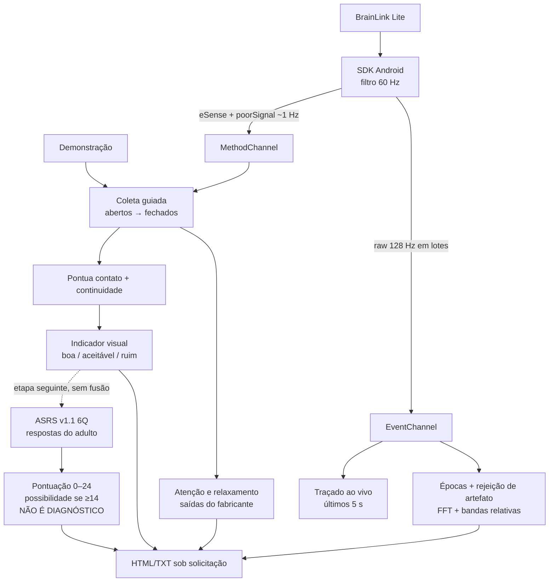

# Fluxo de dados atual

## Regras

- O hardware usa 60 s com olhos abertos e 60 s com olhos fechados.
- A demonstração usa 8 s em cada fase e sempre se identifica como simulada.
- Som e vibração avisam a troca de fase e o final.
- A pontuação de 0 a 100 combina contato (`poorSignal`) e continuidade de
  leituras; não usa attention, meditation, bandas ou ASRS.
- Sem `poorSignal`, o app mostra ausência de dados em vez de inventar zero.
- eSense aparece de forma descritiva e separado da nota de coleta.
- O ASRS usa somente as seis respostas. A partir de 14 comunica possibilidade
  aumentada no rastreio; abaixo disso informa apenas que o corte não foi
  atingido. Nunca recebe EEG, eSense, qualidade de contato ou modo demonstração.
- A interface pode informar se theta ficou maior que beta nas duas fases, mas
  esse estado descritivo não altera a possibilidade calculada pelo ASRS.
- A exportação reúne qualidade, bandas e cada pergunta/resposta do ASRS no mesmo
  arquivo, com seções e cálculos distintos.
- `CODE_RAW` alimenta o traçado e a descrição espectral, mas não entra no
  indicador de qualidade nem na possibilidade de TDAH.
- A sessão precisa ter ao menos 20 épocas aceitas em cada fase e 50% de
  aproveitamento. Caso contrário, o motivo aparece e as bandas não são exibidas.
- Não há histórico, conta ou envio automático. A exportação é voluntária.

## Relacionadas

[[auditoria-codigo]] · [[brainlink-lite]] · [[indices-esense]] ·
[[artefatos-canal-unico]] · [[ADR-002-consumir-eeg-bruto]]
