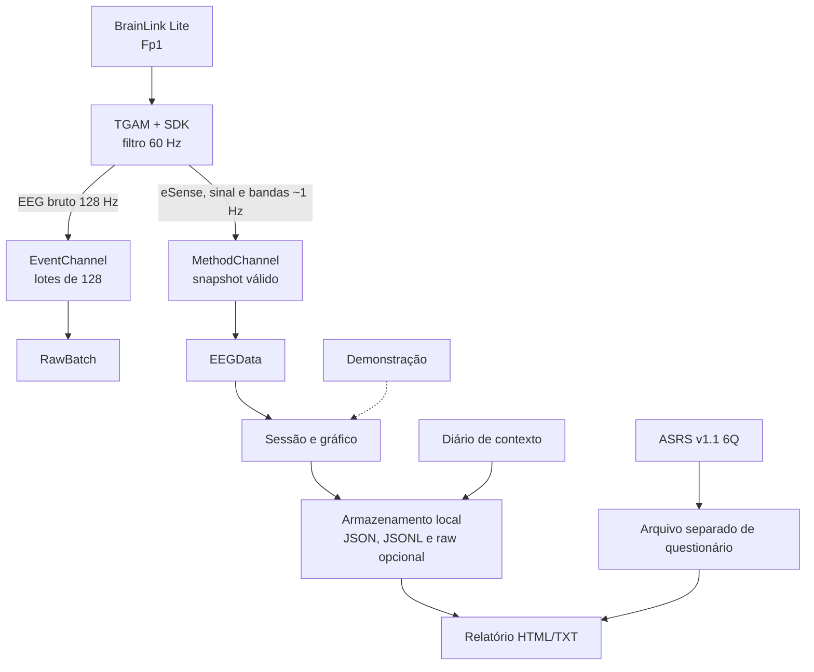

# Fluxo de dados atual

O contrato formal está em `FRONTEND_INTEGRATION.md`. O aplicativo mantém o EEG,
o diário e o rastreio como camadas independentes no relatório.

## Regras do caminho

- `CODE_RAW` não é mais descartado: o Android agrupa 128 amostras e informa
  sequência, instante, qualidade do contato e descartes.
- `CODE_EEGPOWER` inválido não reutiliza um snapshot anterior.
- campos ainda não medidos são omitidos, nunca preenchidos com zero.
- uma época rejeitada registra a razão, mas não exibe um número derivado.
- o gráfico usa demonstração sintética ou dados recebidos pela ponte nativa.
- o ASRS não recebe nem combina valores do headset.
- os arquivos permanecem locais e só saem do app por exportação solicitada.

## Taxas e limites

| Trecho | Taxa | Uso atual |
| --- | --- | --- |
| TGAM → raw | 128 Hz | transporte e persistência opcional |
| TGAM → eSense/bandas | aproximadamente 1 Hz | observação descritiva |
| demonstração → UI | 1 s | validar o fluxo sem equipamento |

O timestamp do lote é registrado no Android e inclui latência de Bluetooth e
buffers. Ele não deve ser tratado como marcador preciso de evento.

## Relacionadas

[[auditoria-codigo]] · [[lacunas-tecnicas]] · [[chip-tgam-protocolo]] ·
[[ADR-002-consumir-eeg-bruto]] · [[ADR-003-persistencia-de-sessoes]]
