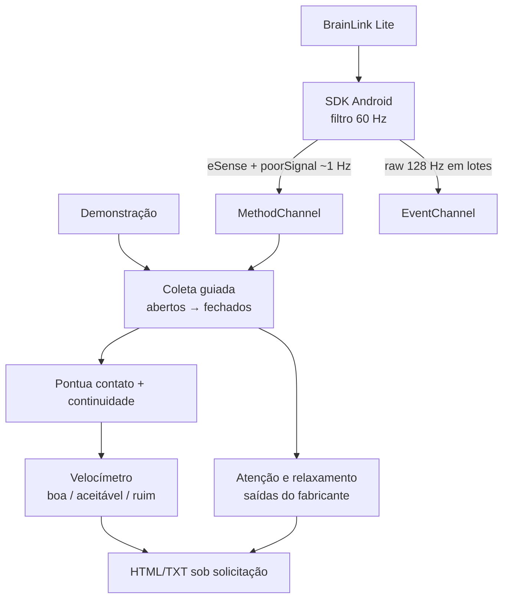

# Fluxo de dados atual

## Regras

- O hardware usa 60 s com olhos abertos e 60 s com olhos fechados.
- A demonstração usa 8 s em cada fase e sempre se identifica como simulada.
- Som e vibração avisam a troca de fase e o final.
- A pontuação de 0 a 100 combina contato (`poorSignal`) e continuidade de
  leituras; não usa attention, meditation, bandas ou ASRS.
- Sem `poorSignal`, o app mostra ausência de dados em vez de inventar zero.
- eSense aparece de forma descritiva e separado da nota de coleta.
- `CODE_RAW` é transportado em lotes, mas não alimenta o velocímetro atual.
- Não há histórico, conta ou envio automático. A exportação é voluntária.

## Relacionadas

[[auditoria-codigo]] · [[brainlink-lite]] · [[indices-esense]] ·
[[artefatos-canal-unico]] · [[ADR-002-consumir-eeg-bruto]]
